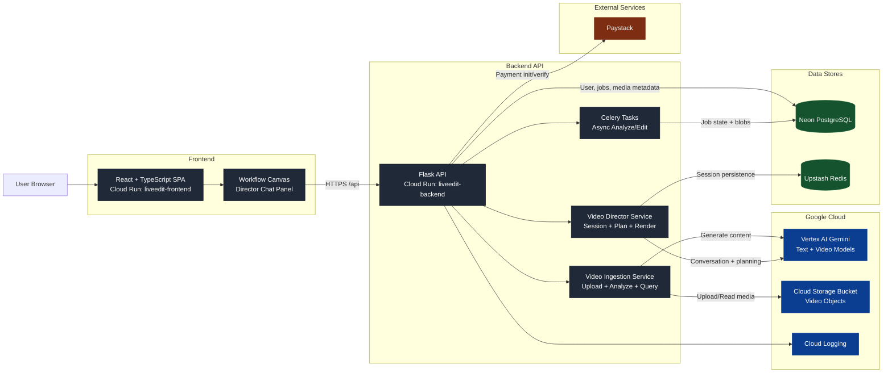

# LiveEdit Architecture Diagram

## Export to image (for submission)
1. Open https://mermaid.live
2. Paste the Mermaid block above
3. Click Actions → Download PNG
4. Upload as: `liveedit-architecture.png`
